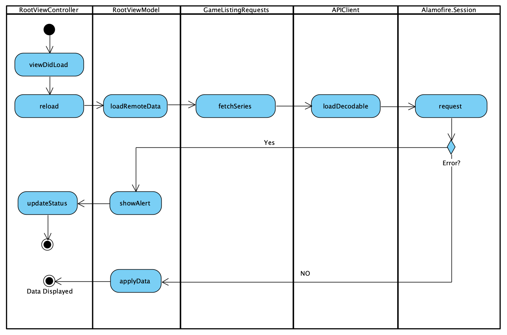

# Super Mario Game Series

An app to load all Super Mario game series that display photos and series information. This app was developed using the latest iOS 13.3 SDK and Swift 5.

## Getting Started

These instructions will get you a copy of the project up and running on your local machine for development and testing purposes. 

### Prerequisites

#### Cocoapods

The project depends on a few libraries declared in the Podfile. The dependence manager used is Cocoapods. If you want to learn more how to install and use it visit their website at www.cocoapods.org

Before you could build and run the project you need to install the cocoapod dependencies. Assuming you aleady have installed cocoapods. Open a terminal at the root of the project and execute the command.

```
$ pod install
```

After everything is installed locate the generated workspace file and open the project using that to include the pod project.

#### IDE

The project was created using Xcode 11.4.

### Running on the Simulator

After installing the cocoapods libraries, open the project in Xcode and select the destination device then click Run.

## Running the tests

While the project is opened in Xcode run the unit tests by pressing the command  + U keys.

## Data flow Activity Diagram

The diagram illustrates the relationship and roles of different entities in the application.



## Design Patterns

The source code is generally a mix of OOP, Protocol Oriented Progamming and the Use of Generics.

### Observer

The view controller observes to view state changes

```Swift
extension RootViewController: Transitionable {
    func display(to newState: SubSceneDestination) {}
    func push(to newState: SubSceneDestination) {
    }
}
```

### Composition

The SeriesDecriptionViewController is compose of a few sub views in order to act as a minimal web browser.

```Swift
class SeriesDecriptionViewController: BaseViewController {
    var searchKey: String!
    
    fileprivate let googleQueryURL = "https://www.google.com"
    fileprivate var webView = WKWebView(frame: .zero)
    fileprivate var progressView = UIProgressView(progressViewStyle: .default)
}
```

### Strategy

This pattern is useful when we want one type to be able to take on different roles / behaviors. For example, if I want to change the behaviour of the RootViewModel so that its behaviour can be manipulated from outside, an additional initializer accepts an instance of a GameListing protocol. This pattern is very useful when unit testing.

```swift
class RootViewModel {
    
    fileprivate var request: GameListing!
    
    init() {
        request = GameListingRequests()
    }
    
    init(request: GameListing) {
        self.request = request
    }
 }
```

### Builder

The centered method helps simplyfy the creation of another instance the may require a lot of setup of its properties.

```swift
struct ConstraintValues {
    var top: CGFloat?
    var left: CGFloat?
    var right: CGFloat?
    var bottom: CGFloat?
    var height: CGFloat?
    var width: CGFloat?
    var centerX: CGFloat?
    var centerY: CGFloat?
    
    init() {
        self.top = 0
        self.left = 0
        self.right = 0
        self.bottom = 0
    }
    
    static func centered(leftMargin: CGFloat, rightMargin: CGFloat) -> ConstraintValues {
        var val = ConstraintValues()
        val.top = nil
        val.bottom = nil
        val.left = leftMargin
        val.right = rightMargin
        val.centerX = 0
        val.centerY = 0
        val.height = nil
        return val
    }
}

```

### Protocol Oriented and Generics

The following code demonstrates the use of protocols and generics.

```swift
struct RowModel: ReuseIdentifier {
    var cellIdentifier: String
    var identifier = UUID().uuidString
    var name: String
    var series: String
    var image: String
    
    init<T>(name: String, series: String, image: String, cellId: T.Type = T.self) {
        self.cellIdentifier = String(describing: cellId)
        self.name = name
        self.series = series
        self.image = image
    }
}

protocol ViewModel {
    func setScreen<T>(screen: T)
}
```


## Built With

* [Alamofire](https://github.com/Alamofire/Alamofire) - *Alamofire* is an HTTP networking library written in Swift. 
* [Reusable](https://github.com/AliSoftware/Reusable) - A Swift mixin for reusing views easily and in a type-safe way
* [Kingfisher](https://github.com/onevcat/Kingfisher) - A lightweight, pure-Swift library for downloading and caching images from the web.
* [SwiftLint](https://realm.github.io/SwiftLint) - A tool to enforce Swift style and conventions.

## Versioning

We use [SemVer](http://semver.org/) for versioning. For the versions available, see the [tags on this repository](https://github.com/your/project/tags). 

## Authors

* **Naz Mariano** -  [LinkedIn](https://www.linkedin.com/in/iamnaz/)

## License

This project is licensed under the MIT License - see the [LICENSE.md](LICENSE.md) file for details

